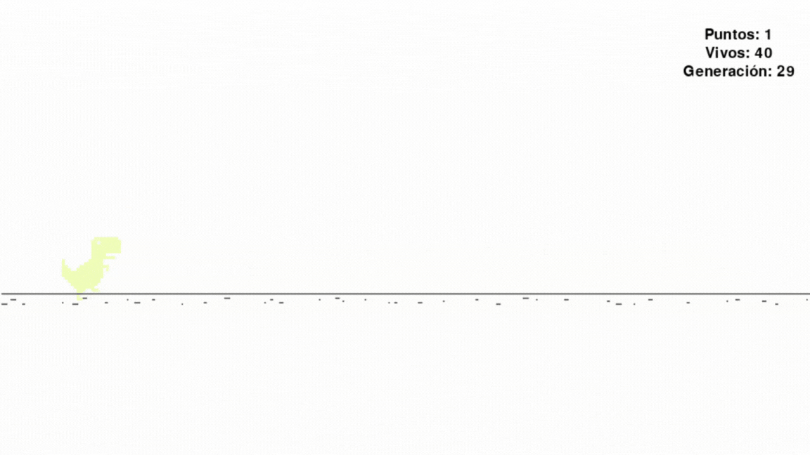

# DINO GAME

## Creado por Juan Ignacio García para la Cátedra de Inteligencia Artificial II de la Universidad de Cuyo.

### UTILIZACIÓN
El juego se ejecuta corriendo el archivo ```main.py```.

```
$ python3 ./main.py
```

Existen 4 modos de ejecución que se pueden seleccionar desde el menú principal de acuerdo a lo que se desee realizar:

* Pulsando 'm' el juego funciona operado por el usuario. El dinosaurio puede saltar o agacharse con las flechas de dirección. Agacharse en mitad de un salto ayuda a aterrizar antes, pudiendo ganar tiempo para preparar el siguiente salto.

* Pulsando 'c' el juego también funciona operado por el usuario, pero se tomarán capturas de pantalla periódicamente que serán guardadas en la carpeta ```./images```, en el subdirectorio correspondiente a la tecla pulsada en el momento de tomar la captura.

* Pulsando 'a' el juego funcionará en modo automático si se ha generado el modelo de _Tensorflow_ que debe ser entrenado con las imágenes mencionadas anteriormente. Para generar el modelo se debe ejecutar el archivo ```BuildTensorflowModel.py``` de la siguiente manera:

```
$ python3 ./BuildTensorflowModel.py
```

* Pulsando cualquier otra tecla el juego funcionará en modo automático de acuerdo a la red neuronal que debe completar en el archivo ```NeuralNetwork.py```. Los parámetros de la red deben ser actualizados usando un algoritmo genético que a su vez se completa en el archivo ```Genetic.py```.

Se recomienda alterar únicamente las regiones del código marcadas entre los siguientes símbolos:

```
# ======================== TEXTO EXPLICATIVO ==============================

# =========================================================================
```

Pero siéntase libre de hacer cualquier modificación que vea pertinente fuera de estas regiones.



### INSTALACIÓN
El código se encarga de instalar automáticamente algunas librerías poco comunes en caso de que el usuario no las tenga. Las librerías en cuestión son Tensorflow, Pillow, Pyscreenshot y Pygame.